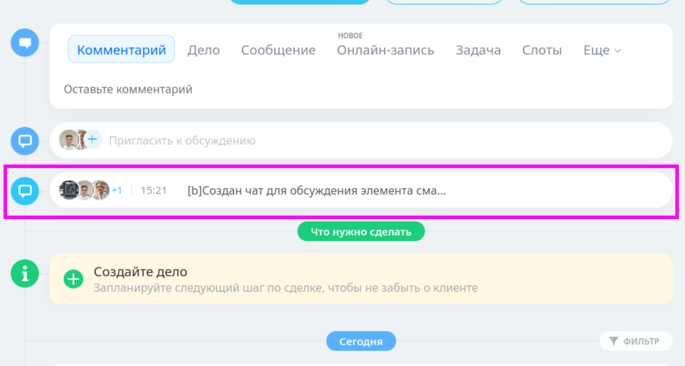

# ChatTransparent

Кнопка чата смарт-процесса в таймлайне сделки Bitrix24 (коробка).

## Что делает

В карточке сделки, в таймлайне — рядом с нативным чатом сделки — появляется кнопка чата смарт-процесса. Внешне идентична нативному виджету `crm-entity-stream-section-live-im`.

Два режима:

- **Чат существует** — надпись «Чат Смарт-процесса», аватары участников, последнее сообщение, счётчик непрочитанных. Клик открывает мессенджер.
- **Чата нет** — надпись «Пригласить к обсуждению», аватары, кнопка-приглашение. Клик создаёт чат через `joinChat()` и открывает мессенджер.

## Скриншот



## Требования

- Bitrix24 коробка, версия с поддержкой смарт-процессов и `Bitrix\Crm\Integration\Im\Chat`
- Установленные модули `crm` и `im`
- PHP 8.1+

## Установка

1. Скопировать папку `ChatTransparent/` в `/local/` на сервере:

```
/local/ChatTransparent/
  config.php
  handler.php
  ajax.php
  script.js
  style.css
```

2. В `/local/php_interface/init.php` добавить одну строку:

```php
require_once __DIR__ . '/../ChatTransparent/handler.php';
```

Если `init.php` ещё не существует — используй `init.php.example` из репозитория как шаблон.

3. Очистить кэш Bitrix24 (Настройки → Настройки продукта → Автокеширование → Очистка кеша).

4. Открыть любую сделку — в таймлайне, под нативным чатом сделки, появится кнопка.

## Настройка

Все изменяемые параметры модуля собраны в одном файле — `config.php`. `handler.php` и `ajax.php` больше не объявляют эти константы.

| Параметр | Файл | По умолчанию | Описание |
|---|---|---|---|
| `CHAT_TRANSPARENT_SMART_PROCESS_TYPE_ID` | `config.php` | `1042` | entityTypeId смарт-процесса. Берётся из URL: `/page/.../type/1042/details/1459/` |
| `CHAT_TRANSPARENT_ACCESS_MODE` | `config.php` | `deal` | Механизм доступа: `sp` или `deal` |
| `CHAT_TRANSPARENT_DEAL_URL_REGEX` | `config.php` | `#/crm/deal/details/(\d+)#` | Регулярка для детекта страницы сделки |

При смене типа смарт-процесса поменяйте `CHAT_TRANSPARENT_SMART_PROCESS_TYPE_ID` только в `config.php`.

## Механизмы доступа

| Значение `CHAT_TRANSPARENT_ACCESS_MODE` | Как открывается чат | Какое право нужно |
|---|---|---|
| `sp` | Нативный `BX.ajax.runAction('crm.timeline.chat.get')` | Право чтения самого смарт-процесса (`canRead` по СП). Без него Bitrix24 вернёт «Доступ запрещен» |
| `deal` | Собственный action `joinChildChat` в `ajax.php` | Право чтения сделки; отдельное право чтения СП не требуется |

В режиме `deal` сервер проверяет Bitrix sessid, право текущего пользователя на чтение сделки и связь запрошенного СП с этой сделкой через `RelationManager::getChildElements()`. Войти в чат по подмене ID сделки или СП нельзя.

При создании чата Bitrix24 автоматически добавляет ответственного и наблюдателей СП. Участник, который уже вошёл в чат, остаётся в нём, даже если позже у него отзовут доступ к сделке. Если такое поведение нежелательно, участника нужно удалить из чата отдельно.

Чтобы сменить режим, задайте `CHAT_TRANSPARENT_ACCESS_MODE` в одном файле — `config.php`. По умолчанию активен режим `deal`.

## Арххитектура

```
 Карточка сделки (URL: /crm/deal/details/123/)
       │
       ▼
 handler.php  ◄── OnProlog хук, инъекция JS/CSS
       │         детектит URL сделки, передаёт dealId и accessMode в config
       ▼
 script.js    ◄── MutationObserver ждёт таймлайн
       │         AJAX-запрос к ajax.php
       ▼
 ajax.php     ◄── RelationManager::getChildElements()
       │         находит смарт-процессы типа 1042, привязанные к сделке
       │         Im\Chat::getChatId() — проверяет чат
       │         возвращает JSON [{entityTypeId, entityId, chatId, hasChat, ...}]
       ▼
 script.js    ◄── рендерит кнопку(и) в DOM
       │         вставляет после нативного чата сделки
       │
       ├─ чат есть → «Чат Смарт-процесса» + последнее сообщение
       └─ чата нет → «Пригласить к обсуждению» + кнопка-приглашение
       │
       ▼  клик
 accessMode=sp   → crm.timeline.chat.get (право чтения СП)
 accessMode=deal → ajax.php:joinChildChat (право чтения сделки + связь СП)
       ▼
 BX.Messenger.Public.openChat('chat' + chatId)
```

### Связь смарт-процесс → сделка

Связь хранится в таблице `b_crm_entity_relation`:

- `SRC_ENTITY_TYPE_ID = 2` (Deal), `SRC_ENTITY_ID = dealId` — родитель
- `DST_ENTITY_TYPE_ID = 1042` (Smart Process), `DST_ENTITY_ID = itemId` — потомок

Поиск через `RelationManager::getChildElements()` (D7). Альтернатива — прямой SQL, закомментированный в `ajax.php`.

### Привязка чата к сущности

Чат привязан к сущности через таблицу `b_im_chat`:

- `ENTITY_TYPE = 'CRM'`
- `ENTITY_ID = '{TypeName}|{EntityId}'` (например, `DYNAMIC_1042|456`)

Поиск через `Bitrix\Crm\Integration\Im\Chat::getChatId()`.

## Файлы

| Файл | Назначение |
|---|---|
| `config.php` | Единая конфигурация изменяемых параметров модуля |
| `handler.php` | OnProlog хук: детект страницы сделки, инъекция JS/CSS |
| `ajax.php` | AJAX-эндпоинт: поиск смарт-процессов, сбор данных чатов |
| `script.js` | Рендер кнопки в таймлайне, клик-обработчик, открытие мессенджера |
| `style.css` | Минимальные стили (иконка, надпись, hover, счётчики) |
| `init.php.example` | Пример подключения в `/local/php_interface/init.php` |
| `ExampleButton.txt` | HTML-образец нативного виджета для референса |

## Иконка

Цвет иконки — синий (`#2fc7ff`), чтобы отличить от дефолтного чата сделки (зелёный `#9dcf00`).

Все иконки таймлайна используют спрайт `icons-sprite.svg` и отличаются `background-position`. Список позиций — в комментарии в `style.css`. Чтобы поменять значок — раскомментируй `background-position` в блоке `.ct-chat-icon`.

`pointer-events: none` на иконке — клик проходит насквозь к родительскому блоку, где висит обработчик.

## Диагностика

1. Открыть консоль браузера (F12) на странице сделки
2. Проверить `window.ChatTransparentConfig` — должен содержать `dealId`, `accessMode`, `ajaxUrl`, `buttonLabel`, `inviteLabel`
3. Проверить AJAX-ответ: `BX.ajax({url: '/local/ChatTransparent/ajax.php', method: 'POST', data: {action: 'getChildChats', dealId: 123, sessid: BX.message('bitrix_sessid')}, onsuccess: console.log})`
4. Пустой массив `[]` — RelationManager не нашёл связь. Попробовать альтернативный SQL в `ajax.php`
5. Ошибка 500 — проверить `/bitrix/php_error_log`
